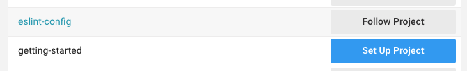

# Creating a new repository within Top Hat Open Source

Project owners can create new repositories within the Top Hat Open Source organization as needed, whether it is for a brand new project or for code not part of an existing project but that would be supporting one of them. To ensure some level of consistency and to make the process of getting started easier, here are some resources that can help. Feel free to clone this repository and use the contents of the `new-repository-kit` as a springboard for new projects.

## Issue templates

Issue templates make the contributor experience infinitely better by providing structure for feature requests, bug reports and other issues that may need to be logged in a repository's issue tracker. You can create your own issue template easily by creating a `.github` directory containing a `ISSUE_TEMPLATE` subdirectory, in which you'll drop your Markdown templates that will be picked up by Github whenever someone tries to open an issue.

A generic issue template would look like this:

```markdown
---
name: My new issue type
about: This issue type is perfect for feature requests!

---

**Description**
A clear and concise description of what you are asking about.

**Screenshots**
If applicable, add screenshots to help explain your problem.

**Desktop (please complete the following information):**
 - OS: [e.g. iOS]
 - Version: [e.g. 1.0]
 - Shell: [e.g. bash/sh/zsh/fish]
 - Node version: [e.g. v8.10.0], from `node --version`
 - ...


**Additional context**
Add any other context about the problem here.
```

Writing templates is as easy as creating a Markdown file in the `.github/ISSUE_TEMPLATE` folder and pushing the changes up!

You can use the base templates for Feature requests and Bug reports present in the `.github/ISSUE_TEMPLATE` directory present in this kit.

## Setting up CircleCI

All of our projects are built (and deployed/published, if relevant) through [CircleCI](www.circleci.com/‎). To get CircleCI started in your repository, create a `.circleci` directory and in it, a `config.yml` file. Before pushing it up, make sure that CircleCI is set up properly for your repository. To do so, head to the [CircleCI app](www.circleci.com/‎) and ensure that the __Set Up Project__ button is not visible on your project under the __Add projects__ section.

<div style="text-align: center">

</div>

The contents of your `config.yml` file will vary depending on the needs of your project, but a simplified template could look like this:

```
version: 2.1

# This will allow you to set up a docker image for everything at once.
docker_defaults: &docker_defaults
  docker:
    - image: circleci/<image>:<tag>

# These jobs are executed by CircleCI
jobs:
  test:
    <<: *docker_defaults
    working_directory: ~/repo
    steps:
      - checkout
      - run: make lint
      - run: make test-coverage
      - store_test_results:
          path: artifacts/reports/tests
  build_and_deploy:
    <<: *docker_defaults
    working_directory: ~/repo
    steps:
      - run: make build_and_deploy

# Your workflow determines how your CI pipeline will look and behave
workflows:
  version: 2
  build_and_test:
    jobs:
      - test
      - build_and_deploy:
          requires:
            - test
          filters:
            branches:
              only:
                - master
```

You can look at the CircleCI configuration files of other Top Hat Open Source projects for examples, and write your own using the [CircleCI configuration documentation](https://circleci.com/docs/2.0/configuration-reference/), which cover all of the possible blocks you can use in your project's CI.

You can find an exhaustive list of CircleCI-provided Docker images [here](https://circleci.com/docs/2.0/circleci-images/), but feel free to refer to any image hosted in other registries.

## Infrastructure and tooling

It can be tremendously useful for both your maintainers and contributors to have tools within reach. Don't hesitate to rely on Docker if you need specific environments to test, develop or build in. Moreover, a well-crafted `Makefile` can streamline a lot of the common tasks that are part of your project's development cycle. Bonus: you can use those in CI!